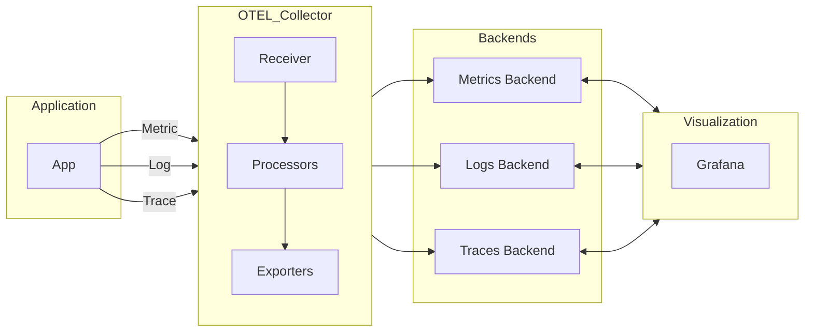
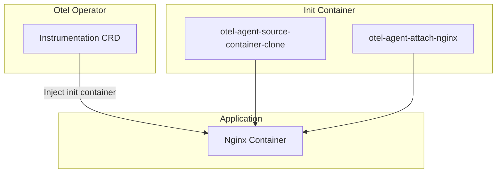

## Otel을 통한 Trace 구현하기
## 구성도


## Otel Operator 
```sh
helm repo add open-telemetry https://open-telemetry.github.io/opentelemetry-helm-charts
helm repo update

# Opterator
helm upgrade --install my-opentelemetry-operator open-telemetry/opentelemetry-operator \
  --set "manager.collectorImage.repository=otel/opentelemetry-collector-k8s" \
  --set admissionWebhooks.certManager.enabled=false \
  --set admissionWebhooks.autoGenerateCert.enabled=true \
  --set manager.extraArgs[0]="--enable-nginx-instrumentation=true"
```

## Otel Collector  
- daemonset
- deployement
- statefulset

```sh
helm upgrade --install my-opentelemetry-collector open-telemetry/opentelemetry-collector \
  --set mode=daemonset \
  --set "image.repository=otel/opentelemetry-collector-k8s"
  --set presets.logsCollection.enabled=true \
  --set presets.kubernetesAttributes.enabled=true \
  --set presets.kubeletMetrics.enabled=true \
  --set presets.kubeletMetrics.enabled=true \
  --set exporters.otlp.endpoint= \ 
```

## Init Container

## Instrumentation
```sh
kubectl apply -f - <<EOF
apiVersion: opentelemetry.io/v1alpha1
kind: Instrumentation
metadata:
  name: nginx-instrumentation
spec:
  exporter:
    endpoint: http://tempo:4317
  propagators:
    - tracecontext
    - baggage
    - b3
  sampler:
    type: parentbased_traceidratio
    argument: "0.25"
  nginx:
    attrs:
    - name: NginxModuleOtelMaxQueueSize
      value: "4096"
EOF
```

## Nginx App
```sh
kubectl apply -f - <<EOF
apiVersion: apps/v1
kind: Deployment
metadata:
  name: nginx
spec:
  replicas: 1
  selector:
    matchLabels:
      app: nginx
  template:
    metadata:
      labels:
        app: nginx
      annotations:
        instrumentation.opentelemetry.io/inject-nginx: "true" 
    spec:
      containers:
      - name: nginx
        image: nginx:1.25.3
        ports:
        - containerPort: 80
EOF

ls /etc/nginx/conf.d/
default.conf  opentelemetry_agent.conf

cat /etc/nginx/conf.d/opentelemetry_agent.conf
NginxModuleEnabled ON;
NginxModuleOtelExporterEndpoint http://tempo:4317;
NginxModuleOtelMaxQueueSize 4096;
NginxModuleOtelSpanExporter otlp;
NginxModuleResolveBackends ON;
NginxModuleServiceInstanceId nginx-66bddcd74d-7tcgp;
NginxModuleServiceName nginx;
NginxModuleServiceNamespace default;
NginxModuleTraceAsError ON;
```
