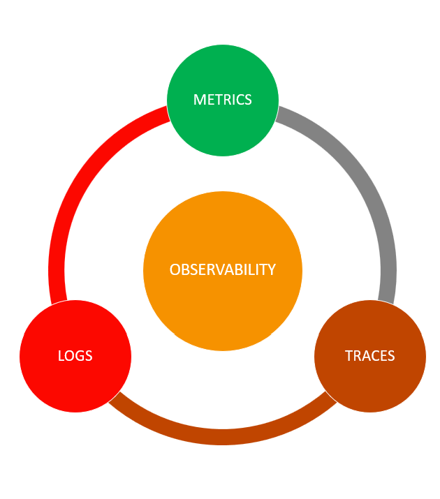
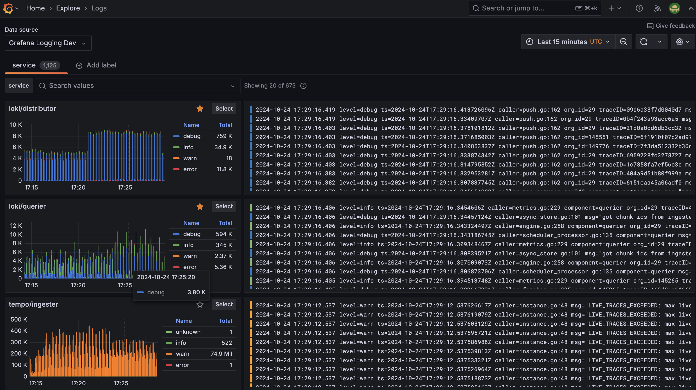
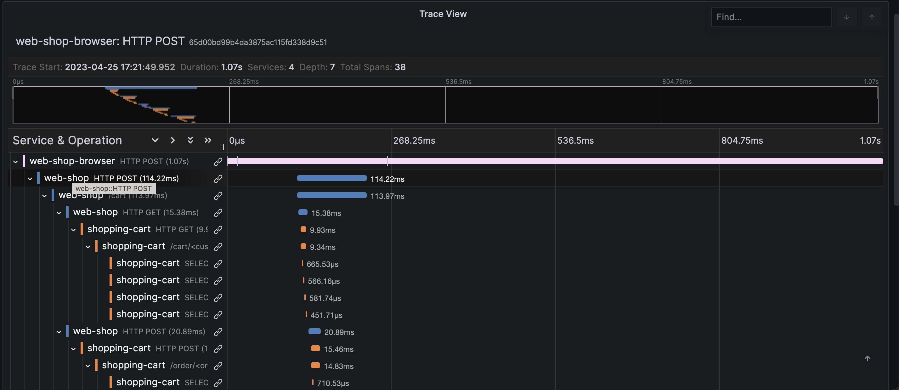
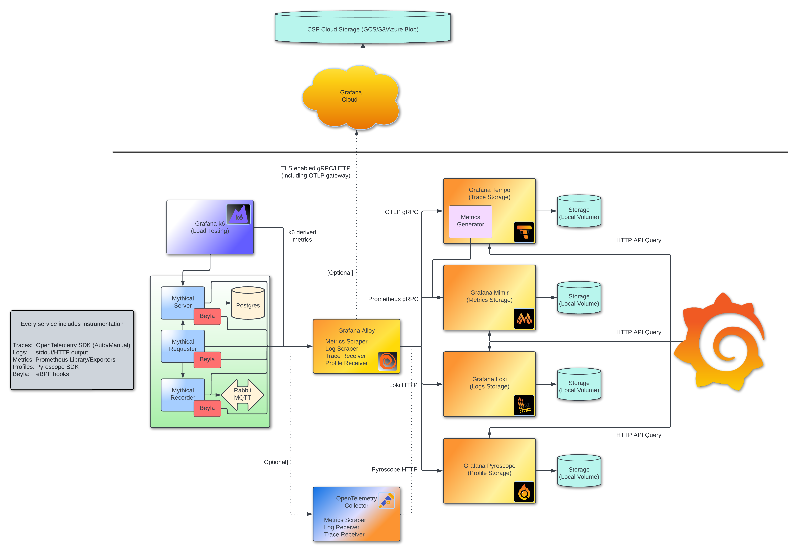
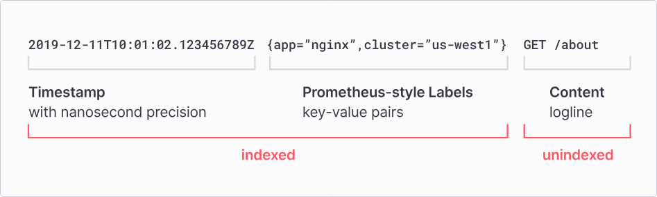
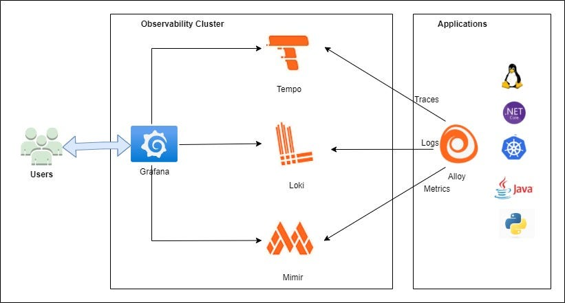
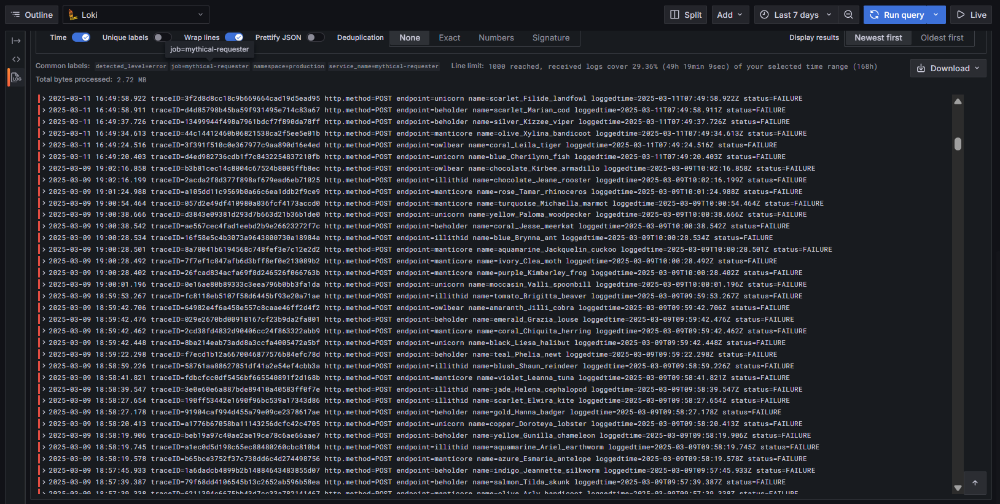
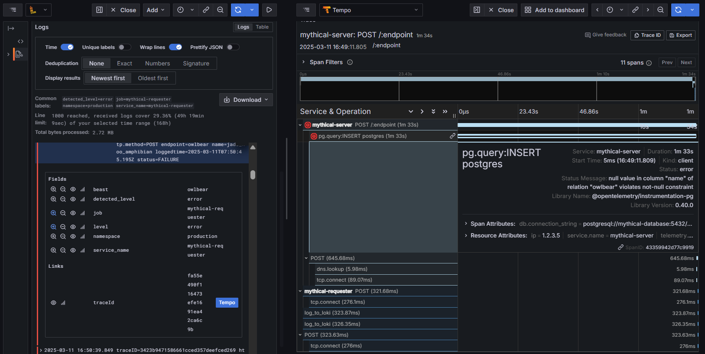

## Observability란?
인체는 서로 다른 기능을 수행하는 여러 시스템으로 구성되어 있다. 소화계, 호흡계, 신경계, 근육 등 모든 시스템이 모여 하나의 인체를 형성한다.

# 

이중 하나 이상의 시스템이 제대로 동작하지 않을 때, 우리는 원인 모를 질병에 시달리거나 기력을 상실할 것이다. 이를 해결하기 위해 우리는 인체의 전문가 즉, 의사를 찾아간다. 

의사는 인체의 체온, 혈압, 산소 수치 등과 같은 신체 지표를 우선 측정한다. 해당 진찰을 통해 우리의 신체 지표 중 이상이 발생한 부분을 발견하고 원인을 파악하기 위해 다양한 검진을 진행할 수 있다. 

이를 통해 의사는 우리 인체 내부에서 무슨 일이 발생하는지 어디서 발생하는 지를 더 자세히 알아볼 수 있다. 또한, 이를 통해 의사는 문제를 해결하고 동일한 문제가 발생하지 않도록 예방 계획을 설립할 수 있다.

소프트웨어에 대한 Observability 또한 마찬가지로 응용프로그램을 실행하는 인프라 시스템 내부에서 무슨 일이 일어나고 있는지 관찰하여, 잘못된 부분이 존재한다면 원인과 위치를 파악하는 것이다.

소프트웨어 시스템을 관찰하기 위해 수집하는 가장 일반적인 데이터에는 메트릭, 로그, 트레이스 등이 존재한다.
### Metrics
# 
메트릭은 소프트웨어 시스템의 상태와 성능에 대한 단서를 제공하는 수치적 데이터다.

시간 경과에 따라 시스템 성능에 대한 단서를 제공하는 메트릭 데이터를 수집할 수 있고, 관찰 대상에 따라 수집하는 데이터 유형이 달라질 수 있다. 

가장 일반적으로 수집되는 메트릭으로는 응답 시간, 요청의 수, CPU 및 메모리 사용량 등이 있다.
### Logs
# 
메트릭을 통해 소프트웨어 시스템의 상태가 이상하다는 것을 파악했다면, 로그를 통해 시스템 내부에서 무슨 일이 발생하고 있는지를 파악해야 한다. 

로그는 시스템 내부에서 발생한 이벤트에 대한 텍스트 기록이며, 문제가 발생한 시기와 해당 문제와 연관된 이벤트에 대한 단서를 제공한다. 이를 참고하면 시스템 내부에서 발생하고 있는 일에 대해 자세한 맥락 파악이 가능하다. 
### Traces
# 
트레이스는 애플리케이션에 대한 요청이 시스템 전체를 경유하는 것을 추적할 수 있다. 우리는 이를 통해 메소드, 서비스와 요청이 어떻게 상호작용하는지 관찰하고 병목 현상이 발생하는 경우 정확한 위치를 추적하여 문제의 발생지를 발견할 수 있다. 

### Project Architecture Diagram

아래의 아키텍처는 Grafana에서 제공하는 `intro-to-mltp`라는 프로젝트의 아키텍처로, 본 글은 Grafana의 Loki, Grafana, Tempo, Mimir를 통해 해당 프로젝트에서 발생하는 에러의 원인을 파악하는 것을 목적으로 한다.

# 

### Loki

# 

로그는 어디서든 발생할 수 있기 때문에 로그에서 특정한 내용을 찾으려고 할 때 다소 어려움이 존재할 수 있다. 또한 시스템의 가동 시간이 길어지고 사용량이 많아질 수록 기록이 방대해지면서 저장 공간의 필요성도 커지고 있다.

또한, 방대한 양의 로그를 어떤 식으로 결합하고 의미있는 방식으로 집계할지에 대한 고민이 필요하다.

이에 더해, 영구적이지 않은 저장소에서 정보를 추출하는 것은 불확실성을 내포하고 있기에 영구적으로 로그를 저장할 수 있는 저장소가 필요하다.

Loki는 이러한 문제를 해결하기 위해 탄생한 로그를 위한 데이터베이스다.

Loki는 로그의 전체 텍스트가 아닌 메타데이터만 색인화하여 저장한다. 따라서, 쿼리가 더욱 빨라질 뿐 아니라 색인만을 스토리지에 저장하므로 저장소의 리소스 사용량이 현저히 감소한다.

# 

### Prometheus & Mimir

메트릭은 시스템이 어떻게 작동하는지에 대한 정량적인 정보를 빠르게 얻는 데 유용하며 숫자로 표현되기 때문에 여러 구성 요소 혹은 시간 경과에 따라 집계할 수 있다.

메트릭 그 자체만으로는 맥락없는 단순한 수치를 나타내기 때문에 문제를 해결하는데 그다지 효과적이지 않다. 구체적인 무언가를 찾기 위해서는 다른 지표를 함께 활용하거나 표현된 숫자가 의미를 갖도록 집계해야 한다.

하지만 메트릭 집계를 위해서는 많은 시간 혹은 리소스가 필요하다.

Prometheus는 메트릭을 위한 데이터베이스지만 기존 데이터베이스와는 다르게 레이블을 사용하여 매우 뛰어난 성능을 자랑한다. 또한 푸시와 풀 기반 모니터링을 제공하기 때문에 애플리케이션 구성 요소가 푸시하는 데이터를 수신할 수도 있고 해당 데이터를 데이터베이스로 가져올 수도 있다.

---

# 

  
Mimir는 프로메테우스를 위한 장기 스토리지와 멀티 테넌트 기능을 제공한다. 또한, 수평 확장이 가능하고 안정적이다.

# 
  
복수의 Prometheus를 운영한다면 Mimir를 활용하는 것이 좋다.

### Tempo

트레이스는 로그와 비슷하지만 서비스나 구성 요소에 대한 것이 아니라 단일 트랜잭션에 대한 흐름, 즉 여러 서비스에서 처리되는 요청을 추적하여 어디로 갔는지 어디에서 얼마나 걸렸는지에 대한 흐름을 파악할 수 있다.

로그와 마찬가지로 저장해야 할 정보가 방대하기 때문에 많은 비용이 소모될 수 있다. 트레이스는 모든 구성 요소가 계측된 경우에만 유효하게 동작하는데 이는 실제로 트레이스를 통해 의미있는 정보를 얻기 위해서는 많은 설정이 필요하다는 것을 의미한다.

Tempo는 분산 트레이스를 위한 데이터베이스이며, 파이프 기반으로 동작하는 TraceQL을 통해 트레이스에 필요한 데이터 수집에 적합하다.

### Pyroscope

프로파일은 애플리케이션이 얼마나 많은 컴퓨팅 파워 혹은 리소스를 사용하는지에 대한 정보이며, 시간 경과에 따라 특정 간격으로 수집된다.

이는 CPU나 메모리 사용률을 알려준다는 점에서 일종의 메트릭이지만, 전반적인 사용률에 관련된 특정 함수 호출까지 세부적으로 살펴볼 수 있다는 점에서 일종의 트레이스와도 같다.

프로파일은 상당한 오버헤드를 발생시키는데, CPU에 대한 정보 수집 시 CPU에 추가적인 작업이 발생할 수 있기에 성능에 영향을 미칠 수 있다.

Pyroscope는 연속 프로파일을 위한 데이터베이스로 애플리케이션의 성능을 위해 구축됐다. 보통 애플리케이션의 복잡도에 따라 프로파일을 수집하는데 1~10%의 오버헤드가 발생할 수 있는데 Pyroscope는 개별적인 측정항목을 저장하지 않고 전체 프로파일의 형태를 파악하는데 필요한 정보만을 저장한다.

### Alloy

Alloy는 OTel, Prometheus, Pyroscope, Loki 및 기타 여려 메트릭, 로그, 트레이스 및 프로파일 도구에 대한 기본 파이프라인을 제공한다.

# 

### Beyla

Beyla는 HTTP/gRPC 애플리케이션 자동 계측을 가능하게 하는 오픈소스 프로젝트다. 프로젝트는 eBPF를 기반으로 하며, 이를 통해 리눅스 커널의 다양한 지점에 프로그램을 연결할 수 있다.

애플리케이션에 대한 계측을 진행하려면 일반적으로 언어 에이전트를 배포나 패키지에 추가하고, 수동으로 트레이스 포인트를 추가한 후 재배포를 해야 한다. 그러나 Beyla를 사용하면 소스 코드를 수정하지 않고 단일 명령으로 모든 서비스에 대해 계측을 진행할 수 있다.

Beyla의 목표는 eBPF를 활용하여 애플리케이션 가시성(application observability)을 빠르게 시작할 수 있도록 돕는 것이고, 수집된 텔레메트리 데이터는 Grafana Labs의 LGTM 스택을 통해 백엔드 및 인프라 데이터와 결합되어, 원활한 풀 스택 오픈소스 가시성 솔루션을 제공한다.

---

### Project에서 활용해보기

# 

Tempo를 통해 각 애플리케이션 서비스를 트레이스 해봤을 때, `mythical-server`와 `mythical-requester`, `postgresql`에서 각각 에러가 발생한다는 것을 확인할 수 있었다.

Loki를 통해 `mythical-requester`에서 발생하는 에러의 로그를 탐색해보았고, 아래의 사진처럼 `POST` 메소드를 통해 각 테이블 엔드 포인트로 요청을 보냈을 때 지속적으로 요청이 실패하는 것을 확인할 수 있었다.

# 
# 

실패한 로그의 트레이스 ID를 Tempo를 통해 추적해본 결과 아래의 사진처럼 데이터베이스에 `INSERT` 쿼리를 보낼 때 문제가 생기는 것을 확인해볼 수 있다.

또한 `mythical-requester`가 `mythical-server`로 보낸 요청 자체가 실패한 것이기 때문에 `mythical-server`와 `mythical-requester`, `postgresql`에서 각각 에러가 발생한 것임을 알 수 있다.

# 

발생하는 에러 메시지를 자세히 확인해보면 다음과 같다.  
`null value in column "name" of relation "owlbear" violates not-null constraint`

이는 `owlbear` 테이블의 `name` 컬럼이 `null` 값을 허용하지 않는 `not-null` 제약조건이 걸려있는데, `INSERT` 요청의 `name` 값이 `null` 이기 때문에 발생하는 문제이다.

좀 더 정확한 확인을 위해 데이터베이스의 `owlbear` 테이블의 제약조건을 조회해보자.

# 

예상했던 대로 `name` 컬럼의 `is_nullable` 값이 `NO`로 설정되어 있는 것을 확인할 수 있다. 해당 프로젝트에서 지속적인 에러가 발생한 원인은 바로 요청에 `name` 값이 결여되어 있기 때문

### Reference

