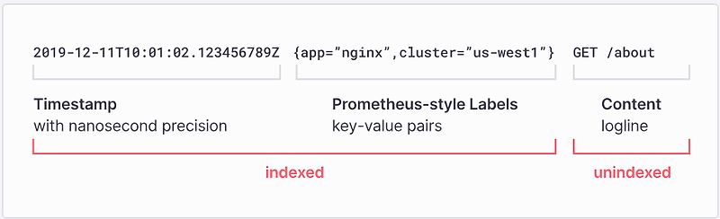
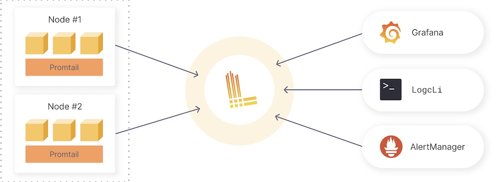

## Grafana Loki 동작 원리

Grafana Loki는 로그 관리 시스템으로, 메타데이터(레이블, 시간 정보)만을 인덱싱한다. 실제 로그 본문은 인덱싱하지 않고 객체 저장소에 보관하며, 인덱스를 기반으로 필요한 로그만 불러오는 방식을 사용한다.



- 메타데이터만 인덱싱 (전체 데이터가 아닌)
- 실제 로그는 객체 저장소에 저장
- 필요 시 로그 본문을 객체 저장소에서 로딩

### 장점
- 저장 효율이 높음 (낮은 저장 비용)
- 확장성이 뛰어남

### 단점
- 본문 전체 검색 시 성능 저하 가능성

## Elasticsearch와의 차이

| 특징         | Loki        | Elasticsearch |
|--------------|-------------|---------------|
| 인덱싱 방식  | 메타데이터만   | 전체 데이터        |
| 검색 성능     | 느림 (본문 검색 시) | 빠름             |
| 저장 비용     | 낮음          | 높음             |

## 구성 요소



- **Promtail**
  - 로그를 Loki로 전송하는 에이전트
  - 로그에 레이블을 지정, 변환 및 필터링 수행

- **Loki**
  - 로그 저장 및 쿼리 처리
  - LogQL을 사용하여 로그 쿼리
  - 객체 저장소를 데이터 저장소로 사용 가능

## LogQL 개념

LogQL은 Loki에서 사용하는 쿼리 언어로 Prometheus의 PromQL과 유사하다 (사실 PromQL도 안써봤음). 크게 두 가지 쿼리 방식이 존재한다.

### Log 쿼리
특정 로그 스트림 선택 및 필터링

레이블 기반 선택: {label_key="label_value"}

필터링 연산자

- |= : 특정 문자열 포함

- != : 특정 문자열 미포함

- |~ : 정규 표현식 포함

- !~ : 정규 표현식 미포함

#### 예시

- 특정 레이블을 가진 로그 선택
```logql
{job="my-service"}
```

- 특정 텍스트가 포함된 로그 검색
```logql
{job="my-service"} |= "error"
```

- 정규 표현식을 이용한 검색
```logql
{job="my-service"} |~ "timeout|failed"
```

### Metric 쿼리
로그 데이터를 기반으로 메트릭을 추출하거나 집계


- count_over_time(): 지정된 시간 내 로그 개수

- rate(): 초당 발생 비율

- avg_over_time(): 시간 내 로그 필드 값 평균

- max_over_time(), min_over_time(): 최대값, 최소값

#### 예시

- 5분 동안 발생한 에러 수 집계
```logql
count_over_time({app="my-app"} |= "error"[5m])
```

- HTTP 요청 중 에러율 계산
```logql
rate({job="api-server"} |= "error"[1m]) / rate({job="api-server"}[1m])
```

- 특정 시간 구간 동안의 평균 응답시간 측정
```logql
avg_over_time({app="my-app"} | json | unwrap duration[5m])
```

## LogQL 실습

회사 노트북에서 실습을 하다가 보안 정책 상 캡처를 못한다는 사실을 알게 되어 실습은 금주내로 공유드릴게요!ㅜㅜ

## 정리
- Loki는 메타데이터만 인덱싱하여 저장 효율을 높임
- Elasticsearch와는 목적과 특성이 다름
- LogQL은 강력한 로그 탐색 및 메트릭 집계를 지원함

사내에서 ES 기반의 로그 시스템이 구축되어 있는데, 생각보다 비용도 많이나오고 복잡한 느낌

Elastic APM + CloudWatch 를 뭔가 적절하게 사용하고 있긴한데, 이왕 o11y 스터디를 하고 있으니 한번 개편을 해봐도 좋지 않을까??

여러분들이 생각하시기에 로그 시스템, 옵저버빌리티 시스템 구축에 비용은 어떤 부분에서 최적화할 수 있다고 생각하시나요?