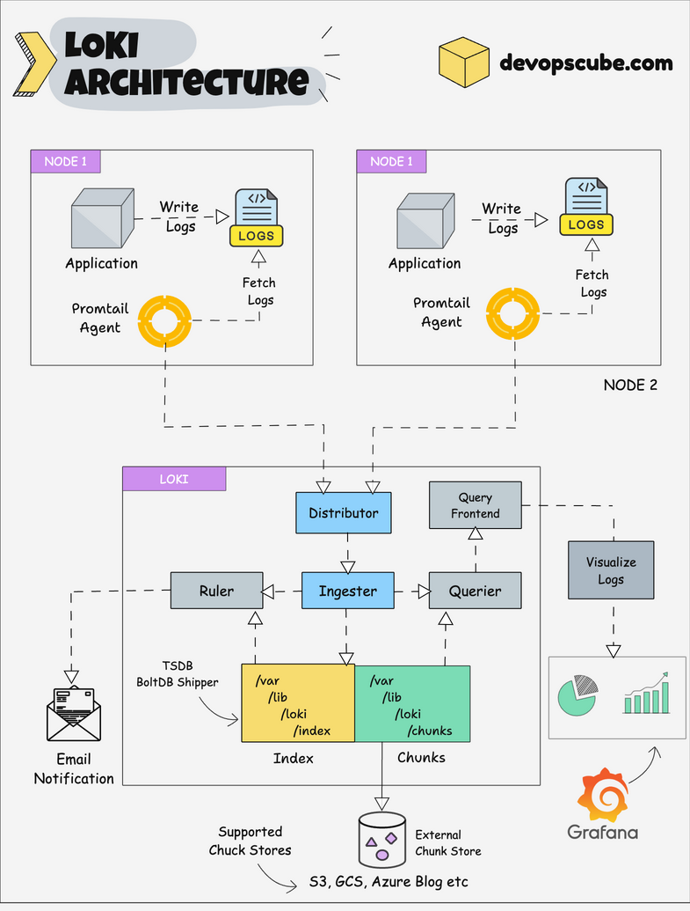

# Grafana Loki 구성요소 학습

## 1. Grafana

>다양한 데이터 소스를 기반으로 실시간 시각화, 모니터링, 경고 등을 제공하는 오픈소스 도구

### 주요 기능
- 대시보드 생성 및 공유
- 메트릭, 로그, 트레이스, 프로파일 통합 시각화
- 다양한 데이터 소스 및 플러그인 지원
- 알림 시스템 내장 (Slack, Email 등)

---

## 2. Grafana Loki 개요

>- Grafana에서 개발한 분산형 로그 수집 및 저장 시스템
>- Prometheus의 메트릭 방식과 유사하게 로그에 라벨을 부여하고 저장

### 특징
- 로그 본문은 압축 저장, 라벨만 인덱싱하여 효율적인 저장
- Prometheus와 유사한 쿼리 언어(LogQL) 사용
- 다양한 로그 수집기(Promtail, Fluent Bit 등)와 연동 가능
- Grafana와 완전한 통합

---

## 3. Loki 로그 처리 및 검색

### 처리 흐름

<p align="center">
  
</p>

출처: [Grafana Loki Architecture: A Comprehensive Guide](https://devopscube.com/grafana-loki-architecture/)


#### 1. 로그 생성 (Application)

- 각 노드(Node 1, Node 2 등)의 애플리케이션이 로그를 생성
- 생성된 로그는 시스템의 로그 파일에 기록됨 (`/var/log/*.log` 등)

#### 2. 로그 수집 (Promtail Agent)

- Promtail 에이전트가 각 노드에서 동작
- 로그 파일을 tail하며 실시간으로 로그 라인을 수집
- 수집한 로그에 라벨(label)을 붙여서 Loki에 전송

#### 3. 로그 수신 및 분배 (Distributor)

- 수신된 로그를 Distributor가 검증
- 라벨 기반 해시 분배 알고리즘을 통해 적절한 Ingester에 전달

#### 4. 로그 버퍼링 및 저장 (Ingester)

- Ingester는 받은 로그를 메모리에 버퍼링
- 일정 시간이나 용량이 되면 데이터를 다음으로 저장:
  - `/var/lib/loki/index`: 라벨 기반 인덱스
  - `/var/lib/loki/chunks`: 로그 본문(청크)

- 동시에, 외부 저장소(S3, GCS, Azure Blob 등)에도 로그 청크를 저장 가능

#### 5. 쿼리 처리 (Query Frontend & Querier)

- 사용자가 Grafana에서 쿼리를 입력하면,
  - Query Frontend가 쿼리를 분할 및 캐싱 처리
  - Querier가 Ingester 또는 외부 저장소에서 필요한 데이터를 검색

#### 6. 룰 평가 및 알림 (Ruler)

- Ruler는 사용자가 정의한 조건(예: 에러 횟수 등)에 따라 로그를 분석
- 조건 충족 시 알림 이메일 전송

#### 7. 시각화 (Grafana)

- Querier가 반환한 데이터를 Grafana가 시각화
- 로그를 필터링, 검색, 그래프화하여 실시간 상태 확인 가능

---

#### 저장소 구성

| 항목 | 경로 또는 위치 | 설명 |
|------|----------------|------|
| 인덱스 | `/var/lib/loki/index` | 라벨 및 타임스탬프 메타데이터 |
| 청크 | `/var/lib/loki/chunks` | 실제 로그 데이터 (압축됨) |
| 외부 저장소 | S3, GCS, Azure Blob 등 | 장기 보관 또는 확장 저장소 |


### LogQL
```logql
{job="nginx"} |= "error"
{filename="/var/log/syslog"} |~ "failed .* login"
count_over_time({app="web"} |= "timeout" [5m])
```

- `{label="value"}`: 라벨 필터링
- `|=`: 문자열 포함
- `|~`: 정규 표현식 필터
- `count_over_time`: 시간 기반 집계

## 4. Loki 로그 수집 방법

GPT 작성

### Promtail 사용 예시

```yaml
scrape_configs:
  - job_name: nginx-logs
    static_configs:
      - targets:
          - localhost
        labels:
          job: nginx
          __path__: /var/log/nginx/*.log
```

### Fluent Bit 사용 예시

```ini
[OUTPUT]
    Name          loki
    Match         *
    Host          localhost
    Port          3100
    Labels        job=fluentbit,host=${HOSTNAME}
```

### 직접 HTTP API로 전송

```bash
curl -X POST http://localhost:3100/loki/api/v1/push \
  -H "Content-Type: application/json" \
  -d '{
    "streams": [
      {
        "labels": "{job=\"manual\"}",
        "entries": [
          {"ts": "'$(date -Iseconds)'", "line": "Hello Loki!"}
        ]
      }
    ]
  }'
```

## 5. Promtail

> - Grafana Loki의 공식 로그 수집기
> - 시스템의 로그 파일을 읽고, 라벨을 붙여서 Loki로 전송

### 주요 특징
- `tail -f`처럼 로그 파일을 실시간으로 감시
- 로그에 라벨(label)을 추가하여 Loki와 함께 사용할 수 있도록 구성
- Kubernetes 환경에서는 Pod의 메타데이터를 자동으로 라벨링
- Loki 외에도 stdout, journald, syslog 등 다양한 로그 소스 지원

### 구성 요소
- positions.yaml: 로그 읽기 위치를 기록해 중복 수집 방지
- scrape_configs: 어떤 로그 파일을 읽을지 정의

### Promtail vs HTTP 비교

| 항목                         | Promtail 방식                                         | HTTP 직접 전송 방식                                |
|------------------------------|--------------------------------------------------------|----------------------------------------------------|
| 구성 난이도                | 간단 (설정 파일만 작성하면 자동 수집)                 | 직접 코드 작성 필요 (API 호출 구현)                |
| 자동화 수준                | 높음 (파일 감시 및 라벨링 자동)                      | 낮음 (로그 생성/전송 로직 수동 작성 필요)         |
| 파일 로그 수집 지원        | O (tail -f 기반 감시)                                 | X (직접 수집 불가)                                 |
| 실시간성                  | 높음 (실시간 전송)                                   | 높음 (직접 전송 시 가능)                           |
| 리소스 사용량              | 낮음 (Go 기반 경량 에이전트)                          | 사용자의 구현 방식에 따라 다름                     |
| 라벨 자동 부착            | O (YAML로 라벨 정의 가능)                             | X (직접 JSON payload 구성해야 함)                  |
| 재사용성 / 유연성         | 높음 (다양한 로그 파일 지정 가능)                     | 낮음 (한 번에 하나씩 전송, 코드 수정 필요)         |
| 운영 환경 적합성           | 적합 (서버, 컨테이너 등에서 안정적으로 사용됨)        | 실험적/개발 테스트용에 적합                        |
| 단점                       | 설정이 많아질 경우 다소 복잡                          | 라벨 누락/전송 실패 등 에러 가능성 높음            |
| 로그 전송 실패 시 처리     | 자동 재시도 및 포지션 저장 지원 

## 6. 언어별 로그 연동 예시

### Go 애플리케이션에서 Loki로 로그 전송

```go
hook, _ := lokihook.NewLokiHook(lokihook.Config{
    Url: "http://localhost:3100/loki/api/v1/push",
    Level: logrus.InfoLevel,
    Labels: map[string]string{"app": "go-service"},
})
log := logrus.New()
log.Hooks.Add(hook)
log.Info("Go application log to Loki")
```

### FastAPI (Python)에서 로그 전송

```python
import requests, json
from datetime import datetime

def send_to_loki(message: str):
    entry = {
        "streams": [{
            "labels": "{job=\"fastapi\"}",
            "entries": [{
                "ts": datetime.utcnow().isoformat("T") + "Z",
                "line": message
            }]
        }]
    }
    requests.post("http://localhost:3100/loki/api/v1/push", json=entry)
```

### Nginx 로그 수집 (Promtail 사용)

```nginx
access_log /var/log/nginx/access.log;
error_log /var/log/nginx/error.log;
```

Promtail 설정 예시:
```yaml
scrape_configs:
  - job_name: nginx
    static_configs:
      - targets:
          - localhost
        labels:
          job: nginx
          __path__: /var/log/nginx/*.log
```

## 7. 참고자료
- https://grafana.com/docs/
- https://grafana.com/docs/loki/latest/
- https://github.com/grafana/loki
- https://github.com/metalmatze/loki-hook