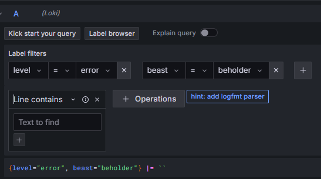
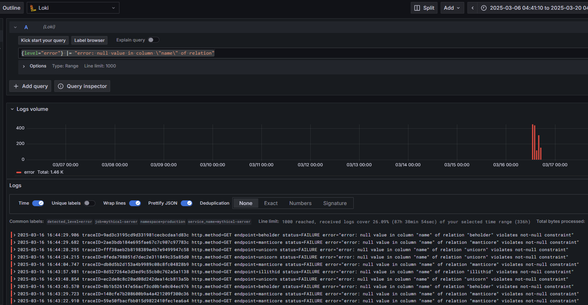
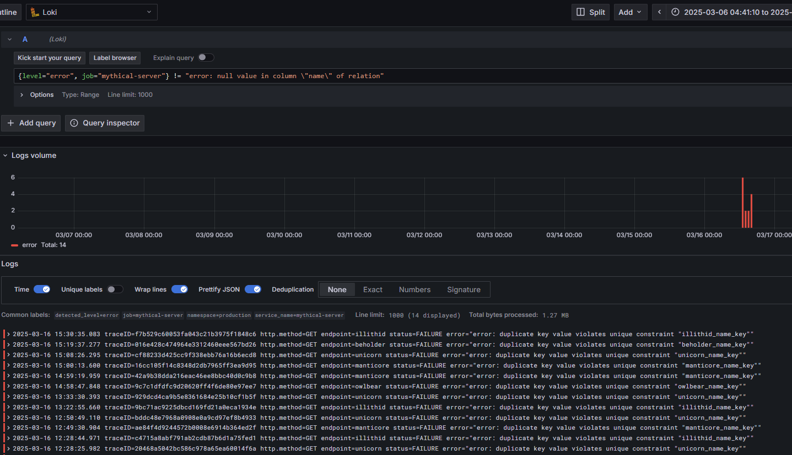
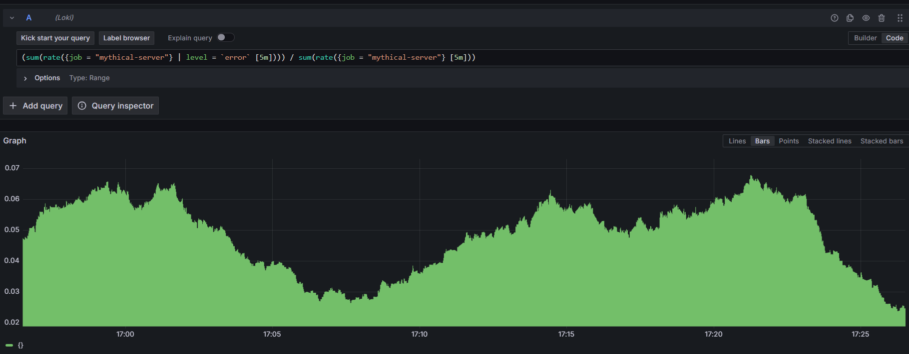
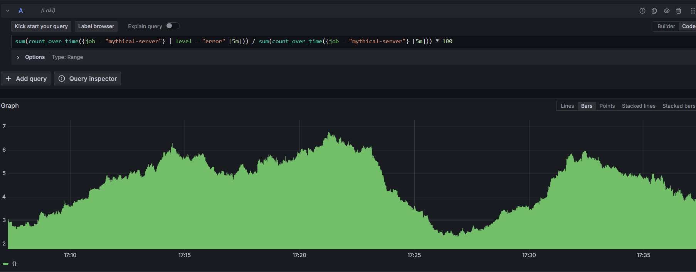

### LogQL

LogQL은 `Log Stream Selector`를 통해 동작한다.

`Log Stream Selector`는 `,`로 분리된 여러 쌍의 Key-Value 형태로 명시된다. 여러 쌍의 Key-Value 데이터들을 `{ }` 로 감싸서 `Stream Selector`를 구분하게 된다.

Grafana에서 제공하는 `intro-to-mltp` 프로젝트에서 `Builder`를 통해 `label`을 선택하게 되면 아래쪽에 Log Stream Selector를 확인할 수 있다.

# 

```
{level="error", beast="beholder"}
```

위 예제의 Log Stream Selector는 모든 Log Stream들 중에서 명시된 Key-Value의 label들을 가지는 스트림들만 쿼리 결과에 포함시키게 된다.

LogQL은 이외에도 여러 연산자를 지원하는데 이 연산자들은 `Label Matching` 연산자라고 불리기도 한다.

-   \= : 정확하게 일치
-   != : 일치하지 않음
-   \=~ : 정규식에 부합함
-   !~ : 정규식에 부합하지 않음

```
{name =~ "mysql.+"} // mysql 이후 어떤 문자가 하나 이상 오는 문자열을 모두 포함 
{name !~ "mysql.+"} // mysql 이후 어떤 문자가 하나 이상 오는 문자열을 모두 미포함 
{name !~ `mysql-\d+`} // mysql 이후 하이픈 + 한자리 이상의 숫자가 오는 문자열을 모두 미포함
```

Builder를 통해 생성된 쿼리를 살펴보면 Log Stream Selector 이외에도 `|= ''` 표현식을 볼 수 있는데, 이는 로그 라인에 해당 문자가 포함되어 있다면 쿼리 결과에 포함시키겠다는 의미다.

실제로 해당 표현식을 제외하고 실행시켜도 실행 결과는 다르지 않기 때문에 Builder를 통해 쿼리를 만들 때 일종의 관례처럼 붙여주는게 아닐까 하는 생각이다.

이전 글에서도 살펴봤듯이 `intro-to-mltp`에서 발생하는 에러는 `Not-Null` 제약조건이 걸려있는 컬럼인 `name` 컬럼에 `null` 값이 삽입되어 발생하는 에러밖에 없는데, 이번에는 LogQL을 통해 이를 좀 더 확실히 확인해보고자 한다.

```
{level="error", job="mythical-server"} |= "error: null value in column \"name\" of relation"
```

위의 쿼리는 `mythical-server`에서 발생하는 로그 중 `level=error` 레이블을 가지고 `null value in column "name" of relation` 에러 메세지를 포함한 에러만을 가져오는 쿼리인데, 해당 쿼리를 실행할 경우 아래의 사진처럼 해당 메세지를 포함한 에러 로그만을 가져오는 것을 확인할 수 있다.

# 


이제 해당 에러 메세지 이외의 다른 메세지를 포함하고 있는 에러를 가져와보자. 쿼리는 다음과 같다.

```
{level="error", job="mythical-server"} != "error: null value in column \"name\" of relation"
```

위의 쿼리를 실행하면 아래의 사진과 같이 결과가 나오게 된다.

# 

이전 글에서 했던 예측과는 다르게 다른 에러를 확인할 수 있었다. 새롭게 발견된 에러 로그의 메세지는 다음과 같다.

`error: duplicate key value violates unique constraint "illithid_name_key"`

해당 에러는 테이블의 키 값에서 유니크 제약조건을 위배했기 때문에 발생한 에러로, `name` 값이 `null` 인 경우에 발생하는 에러에 비해 극히 드물게 발생하기 때문에 쿼리문 없이 단순 로그만을 확인했을 때 파악하기 어려웠던 에러였다.

`mythical-server`에서 발생하는 로그 중 에러 로그의 비율을 확인해보는 것도 가능하다. 쿼리는 다음과 같다.

```
(sum(rate({job = "mythical-server"} | level =`error`[5m]))) / sum(rate({job = "mythical-server"} [5m]))
```

`rate()` 함수는 주어진 시간 범위(`[5m]`, `[10m]` 등) 내에서 초당 로그 발생률을 계산한다. `rate()`는 **로그 수를 시간(초)으로 나눈 평균값**을 반환한다.

즉, `rate({job="mythical-server"} [5m])`은 **최근 5분 동안 발생한 로그 개수를 300초(5분)로 나눈 값**을 의미한다. 해당 비율들을 모두 합산하여 `에러 로그 발생률 / 전체 로그 발생률` 식을 통해 30분 간의 그래프를 확인해보면 다음과 같다.

# 

`rate()` 함수 이외에도 수를 세는 `count_over_time()`를 통해서도 동일한 결과 값을 얻을 수 있다.  
아래 그림은 시간이 좀 경과한 상태라서 그림 자체는 다르게 보이지만 나오는 결과 값 자체는 동일하다.

```
sum(count_over_time({job = "mythical-server"} | level = "error" [5m])) / sum(count_over_time({job = "mythical-server"} [5m])) * 100`
```

# 

그렇다면 비율을 측정할 때 `rate()`와 `count_over_time()` 함수 중 어떤 함수를 사용하는 것이 더욱 효율적일까? ChatGPT의 답변은 다음과 같다.

-   **비율을 시계열 데이터로 표현하기 어려움**
    -   `count_over_time()`은 **고정된 총 개수(정수 값)를 반환**하기 때문에, 이를 시계열(time-series) 그래프로 표현하기 어렵습니다.
    -   반면 `rate()`는 **초당 로그 발생률(logs/sec)**을 반환하여 변화 추이를 쉽게 볼 수 있습니다.
-   **데이터 샘플링 문제**
    -   `count_over_time()`은 5분 동안 **정확히 몇 개의 로그가 있었는지**를 반환합니다.
    -   하지만 `rate()`는 **로그가 일정하지 않은 경우에도 부드러운 값**을 제공합니다.
    -   예를 들어, 5분 동안 로그가 몰려 있다가 갑자기 줄어들면 `count_over_time()`은 급격한 변화를 보이지만, `rate()`는 점진적인 변화를 보여줍니다.
-   **알람 설정 시 부적절**
    -   `rate()`는 **로그 발생 속도를 기준으로 임계값을 설정할 수 있어 알람 설정에 적합**합니다.
    -   반면 `count_over_time()`은 특정 구간의 총 개수만 반환하므로, 일정 주기마다 급격히 변할 수 있습니다.

`count_over_time()` 함수보다는 `rate()` 함수를 사용하는게 더 적합하다고 한다.

### Reference

> [https://grafana.com/docs/loki/latest/query/](https://grafana.com/docs/loki/latest/query/)

> [https://sbcode.net/grafana/logql/](https://sbcode.net/grafana/logql/)
