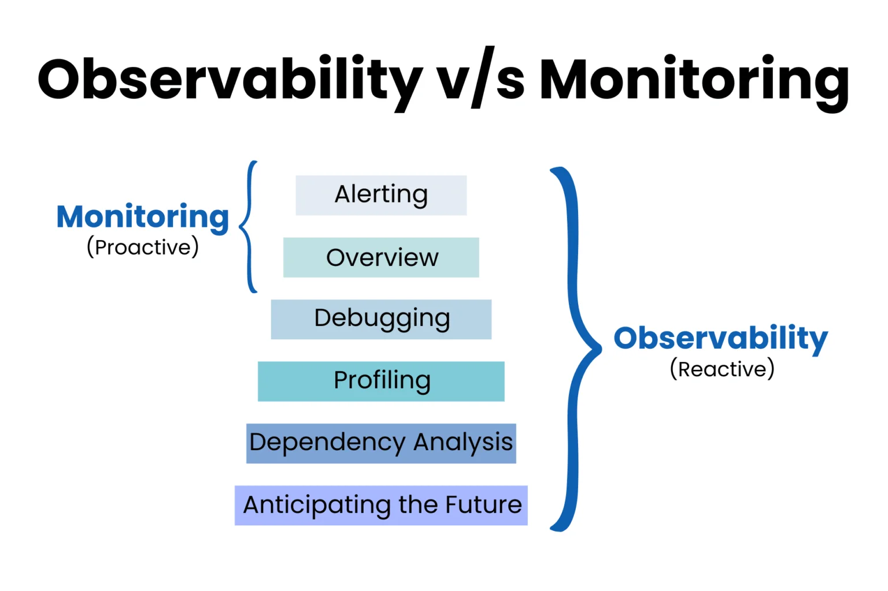

# 1. Observability의 개념
Observability(가시성)는 **시스템의 내부 상태를 외부에서 드러나는 데이터(로그, 메트릭, 트레이스)를 통해 이해하고 분석할 수 있는 능력**을 말한다. 원래는 제어 이론에서 유래한 개념인데, 현재는 소프트웨어 시스템의 안정성과 성능을 유지하기 위한 핵심 개념으로 자리잡았다.

> 시스템이 “observable”하다는 것은, 문제가 발생했을 때 그 원인을 파악할 수 있을 정도로 충분한 정보를 수집하고 있다는 뜻이다. 


## Observability의 3대 구성요소 ("Three Pillars")

### 1. Logs – 이벤트 기반 정보 (무슨 일이 언제 일어났는가?) <br/>
로그(Log)는 애플리케이션에서 발생한 이벤트에 대한 기록으로, Observability의 기반이 된다. 로그 항목에는 일반적으로  timestamp, 이벤트 설명, 보안 레벨, user ID나 session ID와 같은 추가 컨텍스트 등 발생한 이벤트에 대한 정보가 포함된다. Web에서는 HTTP access log를 예시로 들 수 있고, client's IP address, requested URL, response codes 이런 내용들을 캡쳐할 수 있다. <br/>
일반적으로 개발자가 코드에 Logging과 관련된 내용을 추가해야 로그가 남으며, 요즘 대부분의 소프트웨어 라이브러리를 통해 로깅 기능을 빌트인으로 제공한다. <br/>
> 로그 포맷은 다양한데, 일반적으로는 아래와 같다: 
> - **Plain Text**: 가장 단순한 형태의 로그 (사람이 읽을 수 있는 글)
> - **Structured**: 기계가 읽을 수 있는 형식(JSON, XML 등)으로 구조화된 로그 항목
> - **Binary Format**: 이진 형식으로 저장된 로그(Protobuf 로그, MySQL 이진 로그, Systemd 저널 로그 등)
> - **Custom format**: 특정 프로젝트 요구 사항을 충족하기 위해 사용자가 정의하는 커스텀 형식

### 2. Metrics – 시스템 상태를 수치로 표현 (지속적인 상태 감시) <br/>
Metric은 Observability에서 중요한 역할을 하는 속성으로, 일정 시간 간격으로 측정된 숫자로 표시되는 데이터다. 즉, 시스템의 퍼포먼스에 대해 하이레벨에서 정량적 데이터를 제공한다. 정량적 데이터는 CPU utilization, IOPS, memory usage, network throughput, response time와 같은 것을 예시로 들 수 있다. 메트릭을 사용하면 시간 경과에 따른 시스템 상태를 한눈에 파악할 수 있으며, 시간대별 시스템 동작의 추세와 패턴을 파악하는 데 도움이 된다. <br/>
예를 들어, 프로메테우스의 `node_memory_MemAvailable_bytes` 메트릭은 사용 가능한 메모리의 양을 바이트 단위로 보여주고, `http_request_duration_seconds` 메트릭은 HTTP 요청의 지속 시간을 추적한다.


### 3. Traces (Feat. Span) – 분산 시스템에서 요청 흐름을 추적 (병목 분석) <br/>
분산 추적은 특히 복잡하고 상호 연결된 마이크로서비스 아키텍처에서 분산 시스템을 통해 요청의 흐름을 추적하고 모니터링하는 데 사용되는 방법이다. 추적 데이터를 사용하면 애플리케이션의 여러 구성 요소에 걸쳐 요청의 경로를 시각화할 수 있다. 각 추적은 여러 개의 스팬(Span)으로 구성되며, 각 스팬은 추적 내의 특정 작업 또는 프로세스를 나타낸다. 추적을 분석해 전체 시스템에서의 성능 병목 현상이나 오류를 정확히 찾아낼 수 있다.<br/>

예를 들어, 위 그림은 클라우드 네이티브 이커머스 플랫폼에서는 트레이스(추적)를 통해 주문 요청이 프런트엔드에서 결제 및 배송 마이크로서비스로 전파되는 방식을 파악하여 나타낸 것으로, 보이는 것처럼 각 단계는 Span이 존재하고 Span들이 모여 "결제"라는 프로세스를 나타낸다.


<u>**이 세 가지가 통합되어야 “진짜” Observability를 구현할 수 있음 !!**</u>

<br/>

## Logging vs. Monitoring


### Logging:

예외, 경고, 디버깅 정보 등을 포함한다.
- 예: `{"timestamp": "...", "level": "ERROR", "message": "DB 연결 실패"}`

### Monitoring:

대시보드와 알람을 통해 실시간 상태를 감시한다.

- 예: `Prometheus로` 메트릭 수집 → `Grafana로` 시각화 → `Alertmanager로` 알림 발송

> **즉, 로깅을 통해 모니터링을 실현한다고 이해하면 된다.**

<br/>

## Observability vs. Monitoring


<br/>
사진에서 보는 것처럼 Observability는 위에서 말한 전체적인 시스템의 더 나은 운영을 위한 3가지(Log, Metric, Trace)를 기반으로, monitoring은 당장 실시간 서비스 동작에 중요한 3가지 요소(Availability, Performance, Capacity)를 기반으로 데이터를 모으고 처리하는 것에서 차이점을 갖는다.
<br/>

<br/>
위와 같이 Monitoring이 Observability보다 조금 더 작은 개념이라고 생각할 수도 있겠다. 결국 Monitoring 없이는 Observability를 실현할 수 없다.


# 2. Observability의 필요성 및 사용되는 분야
Observability는 단순히 시스템 모니터링을 넘어서, 문제의 원인을 깊이 있게 파악하고 사전에 대응할 수 있는 능력을 갖추게 해준다. 특히 클라우드 네이티브와 마이크로서비스가 일반화된 요즘, observability는 필수가 되었다. 따라서 어느 분야에서 많이 사용되고, 이점이 뭔지 알아봤다.

## 장점 (Benefis)
1. **애플리케이션 성능 모니터링**  
> - 마이크로서비스, 클라우드 네이티브 구조에서도 End-to-End 흐름 파악 가능
> - 로그, 메트릭, 트레이스를 함께 분석하여 빠르고 정확한 문제 해결 가능 

과거에는 장애가 발생하면 로그만 들여다보고 감으로 파악하는 일이 많았지만, observability를 잘 구축해두면 **요청의 흐름(trace)** 과 시스템 상태(metrics), 그리고 **구체적인 에러 상황(log)** 을 함께 보며 빠르게 문제를 파악할 수 있다. 이는 Ops 팀뿐 아니라 개발팀의 생산성 향상에도 크게 기여한다.


**2. DevSecOps 및 SRE 지원**
> - 관찰 가능한 구조 덕분에 더 안전하고 회복력 있는 앱 개발 가능
> - Dev, Sec, Ops 팀이 공통된 데이터를 기반으로 협업 가능 

시스템이 '관찰 가능하게' 설계되어 있지 않으면 어떤 도구를 써도 문제를 정확히 파악하기 어렵다. 코드 단계에서부터 observable한 구조로 개발하고, 운영 환경에서도 이 데이터를 적극 활용하면 더 회복력 있고, 더 안전한 소프트웨어를 만들 수 있다.

**3. 인프라, 클라우드, Kubernetes 모니터링**
> - CPU, Memory 사용량부터 파드 상태, 오토스케일링까지 실시간 상태 확인 가능
> - 클라우드 지연, 리소스 낭비, 장애 요인을 빠르게 탐지하여 운영 효율 향상

클라우드 리소스, 쿠버네티스 클러스터, 네트워크 흐름까지 전체 인프라 상태를 파악할 수 있도록 해준다. 예를 들어 노드 자원이 부족한지, 파드가 자주 재시작되는지, 특정 서비스 간 호출에 지연이 있는지를 빠르게 알 수 있어, 서비스 가용성과 성능 최적화에 직접적인 영향을 준다.

**4. 사용자 경험 향상**
> - 사용자에게 영향을 주기 전에 문제를 감지하고 대응 가능
> - 고객 만족도 및 리텐션 증가, 브랜드 신뢰도 향상

문제가 실제 사용자에게 영향을 미치기 전에 미리 탐지하고 대응할 수 있다면, 고객 불만을 사전에 차단할 수 있고, 이는 곧 브랜드 신뢰도와 수익 향상으로 이어진다. 사용자 피드백을 기다리기보다, 시스템이 먼저 말 걸어주는 구조가 되는 것이다.

**5. 자동화 및 생산성 향상**
> - 알림, 스케일링, 로깅 등의 작업을 자동화하여 개발 및 운영 팀 생산성 증가
> - 반복적인 트러블슈팅 시간 감소 → 작업에 집중 가능


**사람들이 나열하는 여러 장점이 있지만, 내가 생각했을 때 Observability를 사용하는 가장 큰 이점은 결국 <u>1. 애플리케이션 성능 모니터링</u>이다.**


## 사용 분야
- 대규모 분산 시스템 (ex. Kubernetes 기반 MSA)

- 클라우드 인프라 (AWS, GCP, Azure)

- 금융/이커머스/게임/스트리밍 등 실시간 서비스 제공 기업

> 💡 왜 필요한가?
>
> - 시스템이 점점 복잡해지면서, 단순한 로그/모니터링만으로는 원인 분석이 어려움. <br>
>   예) 하나의 요청이 여러 마이크로서비스를 거치는 구조에서는 트레이싱이 없으면 문제 위치를 알기 어려움.
> - 다운타임 최소화, 신속한 디버깅, 서비스 안정성 확보를 위해 필수적임.


# 3. Observability의 도전과제(Challenges)
분명 장점도 있지만, Observability를 완전하게 실현하기 위해 분명 맞닥뜨린 문제점이 있을 거라고 생각했다. 특히, 데이터가 홍수같이 쏟아져나오는 현대에 도전 과제가 뭔지 간단히 알아봤다.

## 도전 과제 (Challenges)

**1. 데이터 사일로(Data Silo)**

> - 로그는 한 곳, 메트릭은 또 다른 곳, 트레이스는 제3의 시스템에 저장
> - 팀마다 다른 도구를 사용하면서 전체적인 문제 흐름 파악이 어려움
> - 협업 단절 및 원인 파악 시간 증가

데이터 사일로는 데이터가 특정 팀, 시스템, 도구에 고립되어 있어 다른 팀이나 시스템과 공유되지 않는 상태으로, 가장 흔한 문제이다. 로그는 A에, 메트릭은 B에, 트레이스는 또 다른 곳에 모여 있다면, 개별 데이터는 볼 수 있어도 전체 상황을 종합적으로 이해하기가 어렵다. 특히 서로 다른 팀이 서로 다른 도구를 쓰고 있다면, 협업은 느려지고 문제 해결 시간도 길어진다.

``` 
예를 들어, 아래와 같은 상황을 데이터 사일로가 있는 상황이라고 한다.
- 인프라 팀은 CloudWatch로 서버 상태를 본다.
- 개발팀은 ElasticSearch 로그를 분석한다.
- DevOps 팀은 Prometheus로 메트릭을 본다.
- 보안팀은 Splunk만 쓴다.

➡️ 그런데 이 도구들은 서로 연결되어 있지 않아서, 하나의 문제를 분석할 때 전체 상황을 파악하기 어렵고, 팀 간 협업이 비효율적이 됨.
```

**2. 데이터 양, 속도, 복잡성 증가**
> - 쿠버네티스와 클라우드 환경에서는 초 단위로 수많은 데이터 발생
> - 너무 많은 Telemetry 데이터로 인해 유의미한 정보 도출이 어려움

마이크로서비스 기반 시스템은 수십, 수백 개의 서비스가 끊임없이 데이터를 생성한다. 컨테이너가 수시로 생성되고 사라지며, 클라우드 인프라는 초 단위로 리소스 상태가 바뀐다. 이 모든 데이터를 수집하고 분석하는 건 만만한 일이 아니다. 단순히 데이터를 쌓는 것만으로는 의미가 없고, 의미 있는 정보로 변환할 수 있어야 한다.

**3. 실사용자 기반의 사전 분석 한계**
> - 프리프로덕션 환경에서 실제 사용자 행태를 정확히 재현하기 어려움
> - 배포 전 성능 예측에 불확실성 존재

사전 배포 환경에서 실제 사용자의 영향을 미리 예측하기 어렵다는 점도 있다. 아무리 로드 테스트를 해도, 실제 사용자들이 어떤 방식으로 시스템을 사용하는지 완전히 재현하긴 어렵다. 결국, 운영 환경에서의 데이터를 기반으로 한 실시간 관찰과 피드백 루프가 중요해진다.

**4. 툴과 표준의 다양성**
> - 다양한 오픈소스와 상용 솔루션이 혼재되어 통합 관리가 어려움
> - OpenTelemetry 같은 표준 도입 필요하지만, 초기 설정 및 운영이 복잡

팀 간 협업에서의 비효율도 도전 과제다. 문제가 발생했을 때 애플리케이션 개발자, 인프라 운영자, 보안 담당자, DevOps 엔지니어 등 여러 팀이 동시에 들어와 원인을 찾는 과정에서 시간과 에너지가 소모된다. 각 팀이 보는 데이터 포인트가 다르고, 해석 방식도 다르기 때문이다. 결국, 공통된 기준과 통합된 데이터 플랫폼이 필요하다.

**결국 내가 생각하는 도전 과제 중 가장 중요한 부부은 <u>"데이터의 복잡성을 어떻게 효율적으로 처리할 것인가?"</u> 인 거 같다. 빅데이터 시대인 만큼, 다양하고 방대한 데이터를 얼만큼 지속적이고 통합적으로 관리하냐에 따라서 Observability의 효율성이 높아질거 같다.**

<br/>

다음 편에서는 기업의 실제 사례를 통해 실제로 어떻게 사용하는지와 각 분야별 사용툴을 비롯해 구현 방식에 대해서 알아보려고 한다.

<br/>

---
**출처**

- https://devopscube.com/what-is-observability/
- https://www.linkedin.com/pulse/cloud-observability-best-practices-tools-enterprise-dar/
- https://casber.substack.com/p/observability-in-2024
- https://www.atatus.com/blog/observability-vs-monitoring/
- https://cloudzenix.com/observability-a-critical-practice-to-enable-digital-transformation/
