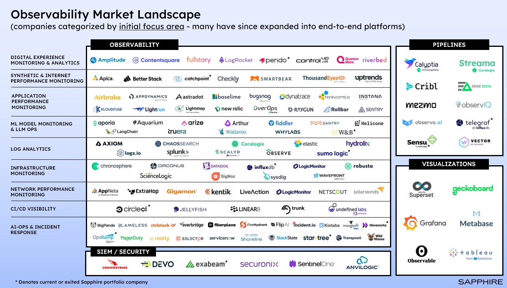
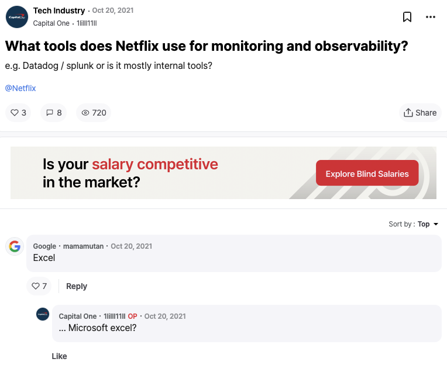

# 1. Observability Market Landscape


<br/>
참고: 그래프 속 기업은 초기 집중 영역별로 분류되어 있으며, 현재는 많은 기업이 초기 분야 뿐만 아니라 여러 분야에 걸쳐 통합 서비스를 제공하고 있다.

<br/>
Observability 실습을 하고 실제 모니터링이 어떻게 이루어지는지 알아보고자 하는데, 그 전에 카테고리에 따라 어떻게 툴이 있는지 간단하게 살펴보고자 한다. Observability 안에서도 AI용도, CI/CD용도, Network 용도 등의 다양한 목적별 툴이 존재한다. 그 중 가장 유명한 툴 몇 개를 간단하게 보겠다. 

### 🔹 Metrics
- **Prometheus**: 시계열(time-series) 데이터를 수집하고 저장하는 오픈소스 모니터링 시스템. Kubernetes 환경에서 가장 널리 사용되며, PromQL이라는 쿼리 언어로 유연한 질의가 가능하다.
- **Grafana**: Prometheus와 같은 데이터 소스를 시각화하는 데 사용되는 대시보드 툴. 다양한 플러그인을 통해 메트릭 외에도 로그, 트레이스를 함께 통합해 볼 수 있다. 
    - DataDog(다만 얘는 SaaS라서 직접 구성에 제한이 있음)과 함께 요즘 대세 !! (Metrics + Logs + Traces를 한 화면에서 연결해서 볼 수 있기 때문에 사람들이 많이 사용함)

### 🔹 Logs
- **ELK Stack:**
    - Elasticsearch: 로그 데이터를 색인하고 검색하는 역할
    - Logstash: 다양한 소스에서 로그를 수집하고 가공
    - Kibana: 로그 데이터를 시각화하는 대시보드로, 전통적으로 가장 많이 사용되는 로그 스택이지만, 설치 및 운영이 다소 무거운 편이다.
- **Loki**: Grafana에서 개발한 로그 수집 시스템으로, Prometheus처럼 label 기반 쿼리를 지원한다. 구조가 간단하고 Grafana와의 연동이 뛰어나며, 비교적 가볍게 사용할 수 있다.

### 🔹 Traces
- **Jaeger**: CNCF에서 호스팅하는 분산 트레이싱 시스템. 마이크로서비스 환경에서 요청 흐름을 시각적으로 추적하고 병목 지점을 파악하는 데 유용하다.
- **OpenTelemetry**: Metrics, Logs, Traces 모두를 다루는 오픈소스 Observability 표준. 다양한 언어와 백엔드와 연동이 가능하며, Jaeger, Prometheus 등과 통합하여 사용할 수 있다.

<br/>
일반적인 서비스는 세 가지 카테고리의 툴들을 하나씩, 총 3개의 툴을 이용해서 구현한다. 그 이유는 각각이 맡는 역할이 명확하기 때문인데, 사실 현대는 많은 서비스들이 통합 플랫폼으로 거듭났기 때문에 1-2개의 서비스로도 운영이 가능하다.

<br/>

> 기본적으로 각 카테고리의 역할은 아래와 같다 :
> - Metrics: 빠른 이상 감지
>   - CPU, Memory, Request 수 등의 수치 기반 데이터
>   - 빠르게 “무슨 일이 일어나고 있는지” 파악 가능
>   - 예: “트래픽이 급증했다”, “에러율이 높아졌다”
> - Logs: 상세 원인 파악
>   - 에러 메시지, 디버깅 정보 등 텍스트 기반 기록
>   - Metrics로 감지된 이상을 깊게 파고들 때 필요
>   - 예: “에러 코드 500의 정확한 스택 트레이스를 보고 싶다”
> - Traces: 요청 흐름 분석
>   - 마이크로서비스 환경에서 요청이 어떻게 흐르는지 시각적으로 추적
>   - 병목 구간, 실패 지점을 한눈에 파악
>   - 예: “요청이 어디서 지연됐는지 알고 싶다”

<br/>
🔽 같이 사용하는 구조 예시 (Kubernetes 기준)

```
사용자 요청
   ↓
[Ingress/Service]
   ↓
[Microservice A] --┬→ Metrics (Prometheus)
                   ├→ Logs (Loki or ELK)
                   └→ Trace (Jaeger via OpenTelemetry)
```

각 툴 별로 실습을 하며 자세하게 공부를 할 예정이며, 별개의 포스팅으로 하나씩 올릴 예정이다.


<br/>

# 2. Observability Usecase (기업 사례)
큰 기업들이 어떻게 모니터링을 구성하고 있는지 확인하보려고 했으나, 스택만 간신히 찾을 수 있고 큰 정보가 없어서 각 기업이 사용하는 툴을 비롯한 간단한 내용들만 적었다.

### 🔸 Netflix

( 넷플릭스 구조 관련해서 찾아보다 발견한 글 -- 유머 한 스푼 두고 갑니다 .. ㅎㅎ)
<br/>
<br/>

넷플릭스는 자체적인 플랫폼을 많이 사용한다. 따라서 구체적인 구현은 보지 않고, 어떤 기능이 툴을 개발했는지와 그 이유를 간단하게만 정리하고 넘어간다
- 수백 개의 마이크로서비스를 운영
- 자체 Observability 플랫폼을 사용해 메트릭, 로그, 트레이스를 통합 관리
    - Mantis: 실시간 스트리밍 데이터를 처리하고 분석할 수 있는 스트캐링 기반 플랫폼
    - Atlas: 시계열 데이터 수집 및 시각화 도구 (Metrics)
    - Vector: 로그 수집 파이프라인
    - Edda: 클라우드 리소스 상태 추적
    - Titus: 컨테이너 관리와 연동된 모니터링
    - Kayenta: 자동화된 카나리 분석 도구
    - Spinnaker: CI/CD 파이프라인 통합
- 장애 복원력(Resilience)을 높이기 위해 Observability에 큰 투자를 함

넷플릭스가 운영하는 기술 블로그에 따르면 넷플릭스는 사업의 규모가 커짐에 따라 방대한 인스턴스 수를 처리하는 것뿐만 아니라 대규모 마이크로서비스 기반 아키텍처를 위한 신속하고 실행 가능한 인사이트를 제공하는 것이 중요해졌다. 특히, 마이크로서비스 아키텍처로 전환하고 트패픽이 방대해짐에 따라 기존의 툴로는 기업의 니즈르 만족할 수 없어 새로운 툴을 개발한 것으로 보인다. 
서비스의 규모가 어느 정도 이상으로 커지면 영구 저장소에 로그를 계속 저장하는 것에 한계가 발생한다. 따라서 선택적으로 로그를 저장하거나 스트리밍(real-time stream)을 통해 메모리에 일시적으로 저장한 뒤, 필요에 따른 전처리를 한 뒤 원하느 로그만 영구 저장소에 저장하는 방법을 사용한다. 이러한 기능을 제공하는 서비스 중 하나가 Mantis이며 Netflix가 자체 개발했다. <br/>


### 🔸 Pinterest

- 핀터레스트의 observability 구성은 아래와 같다 :
    - Honeycomb: 2021년부터 도입한 서비스로, 복잡한 서비스의 실시간 고급 데이터 시각화 지원을 통해 모니터링이 가능하게 함
    - Stasboard: 시각화 및 대시보드
    - Logsearch: 디버그 로그 분석
    - Pintrace: 분산 트레이싱 시스템으로 마이크로서비스 환경에서 요청 흐름을 추적하고 성능 튜닝 및 근본 원인 분석에 활용
    - TScript: 시계열 데이터를 분석하기 위해 자체 개발한 언어로 복잡한 메트릭 연산을 쉽게 표현해 빠르게 처리할 수 있음
- 장애 발생 시, 트레이스 기반 분석으로 병목 구간 신속 파악가능

<br/>

> 적지만 기업 사례들을 보면서 느낀 점은 데이터가 방대하게 쏟아지는 만큼, 현재 기업들이 집중하고 있는 것은 **"어떻게 쏟아지는 데이터를 빠르게 처리하고, 불필요한 데이터(로그)를 걸러내어 저장 비용을 적게 사용할 것인가"** 인 거 같다. 

<br/>

# 3. Observability Labs

Observability를 구성하는 카테고리 별 간단한 실습이라도 해보고 싶어 구글링하다가 발견한 실습 사이트이다. <br/>
> https://observability.courselabs.co/

<br/>
차근차근 실습하면서 내용 추가 업데이트 할 예정이다.

<br/>

---
출처
- https://casber.substack.com/p/observability-in-2024
- https://netflixtechblog.com/tagged/observability
- https://netflixtechblog.com/a-microscope-on-microservices-923b906103f4
- https://netflixtechblog.com/lessons-from-building-observability-tools-at-netflix-7cfafed6ab17
- https://www.baeldung.com/java-netflix-mantis
- https://medium.com/pinterest-engineering/analyzing-time-series-for-pinterest-observability-95f8cc0c5885
- https://www.usenix.org/sites/default/files/conference/protected-files/srecon19emea_slides_abbas.pdf


