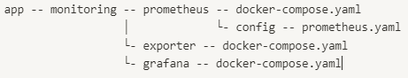
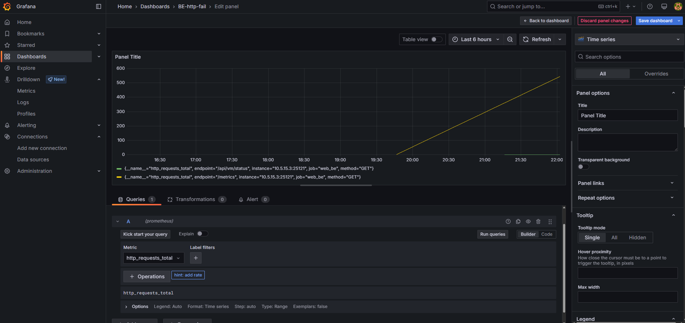

# 메트릭 수집하기

## 메트릭 collector 띄우기

### Prometheus vs Alloy

| 항목                   | Prometheus                                        | Grafana Alloy                                                |
|------------------------|--------------------------------------------------------|-------------------------------------------------------------------|
| 역할               | Time-series DB + 메트릭 수집기                        | 범용 수집기 (메트릭, 로그, 트레이스 등)                         |
| 주요 기능          | - 메트릭 Pull 수집<br>- 시계열 저장<br>- PromQL 쿼리 | - 메트릭/로그/트레이스 수집 및 변환<br>- 라우팅 및 리랩핑       |
| 저장 기능          | 자체 TSDB 내장 (로컬 저장)                           | 저장 기능 없음 (→ 외부 Backend로 전송)                          |
| 수집 방식          | 주로 Pull 방식                                    | Push, OTLP, Prometheus remote_write 지원             |
| 확장성             | 수직 확장 중심 (고가용성 구성 어려움)                | 수평 확장 가능 (단일 binary, 경량)                              |
| 구성 난이도        | 비교적 단순 (단일 목적)                              | 상대적으로 복잡 (다기능 라우팅 구성 필요)                      |
| 표준 지원          | Prometheus 에코시스템 중심                            | OpenTelemetry 등 다양한 표준 지원                               |
| 사용 사례          | - 인프라 메트릭 수집<br>- 단독 모니터링 시스템       | - 통합 Observability Pipeline<br>- 경량 에이전트로 활용         |
| 대체 가능 여부     | Alloy가 Prometheus scrape 기능만 대체 가능        | 완전한 Prometheus 대체 불가 (TSDB 없음)                    |
| 대표 사용 구조     | `Exporter → Prometheus → Grafana`                    | `Exporter/App → Alloy → Prometheus/Loki/Tempo`                   |

- Grafana Alloy는 application metric 수집을 위해 Grafana Mimir를 추가로 사용해야 하는 등의 작업이 필요함
- Grafana Alloy 대비 Prometheus는 metric 수집, 저장에 기능이 한정되어 있지만 metric에 있어서는 사용이 더 쉽고 자체 TSDB를 사용하는 장점이 있음
- 결론: Prometheus 사용!!

### 실습

<p align="center">
  
</p>

```YAML
# ./prometheus/docker-compose.yaml
services:
  prometheus:
    image: prom/prometheus:latest
    container_name: prometheus
    ports:
      - "9090:9090"
    volumes:
      - ./config/prometheus.yaml:/etc/prometheus/prometheus.yaml:ro
      - prometheus_data:/prometheus
    command:
      - "--config.file=/etc/prometheus/prometheus.yaml"
      - "--storage.tsdb.path=/prometheus"
      - "--web.enable-lifecycle"
```

```
# ./prometheus/config/prometheus.yaml
global:
  scrape_interval: 15s

scrape_configs:
  - job_name: 'prometheus'
    static_configs:
      - targets: ['localhost:9090']

  - job_name: 'node_exporter'
    static_configs:
      - targets: ['YOUR_IP:9100'] # IP 또는 FQDN; prometheus와 target이 동일한 docker network에 위치할 경우 컨테이너 이름으로도 호출 가능!

  - job_name: 'web_be'
    static_configs:
      - targets: ['YOUR_IP:YOUR_PORT'] # Service IP / PORT, /metrics endpoint가 반드시 존재해야함.
```

- 수집하고자 하는 metric이 늘어난다면 endpoint를 생성하고 job을 추가하면 됨

## System Metric

### 정의
>- 운영체제, 컨테이너 런타임, 하드웨어, 인프라 레벨에서 수집되는 메트릭
>- CPU 사용률, 메모리 사용량, 디스크 I/O, 네트워크 트래픽 등
>- Prometheus Node Exporter, CAdvisor, Kubelet 메트릭 등을 exporter로 사용

### 실습

```
# ./exporter/docker-compose.yaml
services:
  node_exporter:
    image: quay.io/prometheus/node-exporter:latest
    container_name: node_exporter
    command:
      - '--path.rootfs=/host'
    network_mode: host
    pid: host
    volumes:
      - '/:/host:ro,rslave'
```

- node exporter는 Docker 환경에서도 실행 가능하지만 바이너리 파일로도 실행 가능

## Application Metric

### 정의
>- 애플리케이션 코드 내에서 명시적으로 정의하고 전송하는 메트릭
>- HTTP 요청 처리 시간, DB 쿼리 시간, 큐 대기 시간, 사용자 이벤트 횟수 등
>- Middleware에 작성하기에 따라 커스텀도 가능!
>- OpenTelemetry SDK, Prometheus Client Library 등을 사용해서 생성 가능

### 실습

```python
@app.middleware("http")
async def metrics_and_cors_middleware(request: Request, call_next):
    start_time = time.time()

    logging.debug(f"Request origin: {request.headers.get('origin')}")
    response = await call_next(request)

    origin = request.headers.get('origin')
    if origin in origins:
        response.headers["Access-Control-Allow-Origin"] = origin
    response.headers["Access-Control-Allow-Credentials"] = "true"
    response.headers["Access-Control-Allow-Methods"] = "GET, POST, PUT, DELETE, OPTIONS"
    response.headers["Access-Control-Allow-Headers"] = "Content-Type, Authorization"
    logging.debug(f"Response headers: {response.headers}")

    # Prometheus metrics 기록
    process_time = time.time() - start_time
    REQUEST_COUNT.labels(request.method, request.url.path).inc()
    REQUEST_LATENCY.labels(request.url.path).observe(process_time)

    return response

# Prometheus metrics endpoint
@app.get("/metrics")
def metrics():
    return Response(generate_latest(), media_type=CONTENT_TYPE_LATEST)
```

## Grafana에서 조회하기
### 시스템 메트릭 조회하기

<p align="center">
  
</p>

- `node_`로 시작하는 메트릭들은 전부 node exporter 에서 생성된 메트릭들임.
- `node_pressure_memory_stalled_seconds_total`은 메모리 부족으로 시스템이 정지된 시간의 총합

### 애플리케이션 메트릭 조회하기

<p align="center">
  
</p>